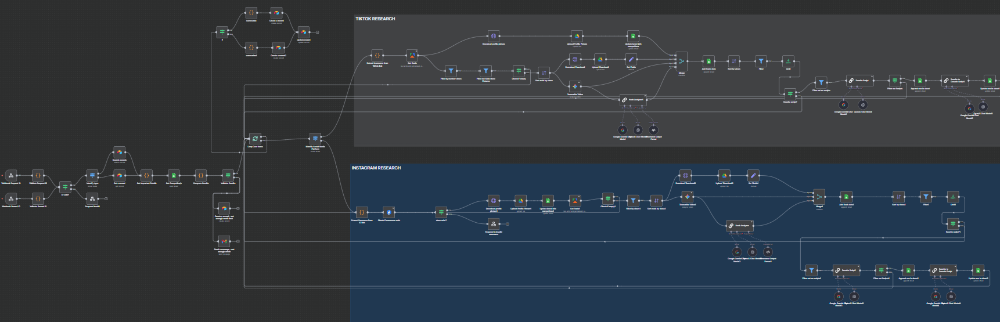

## Meedro Social Media Research Agent


This `n8n AI agent workflow` automates **social media research for TikTok and Instagram** reels and content. It integrates multiple AI models and APIs to fetch user data, analyze video content, rewrite scripts, and log results systematically. The automation revolves around validating incoming requests, querying user records, scraping competitor data, performing AI-powered content analysis, and updating Google Sheets and Airtable with insights and transformed content.




---

### 💡 Why Use Meedro Social Media Research Agent?
- Automates TikTok and Instagram reel data gathering from competitor profiles.
- Utilizes AI (Google Gemini, OpenAI GPT models) to analyze, transcribe, and summarize video content.
- Automatically rewrites video scripts into user-specified languages and generic templates.
- Manages user credits to prevent overuse and sends email notifications on insufficient credits.
- Updates multiple data stores including Google Sheets and Airtable for audit logs and ongoing tracking.
- Downloads and uploads profile pictures, thumbnails, to Google Drive and links them in sheets.
- Handles varying request types (by Record ID or Request ID) to adapt workflow paths accordingly.
- Efficiently processes and batches social media content data for scalable automation of research tasks.

---

### ⚡ Who Is This For?
- Social media managers and marketers conducting competitor analysis.
- Content strategists needing automated insights from video content.
- Agencies leveraging AI for social media content optimization.
- Developers integrating AI-driven workflows with Google Sheets, Airtable, and APIs.
- Businesses using credit-based consumption models requiring usage validation.

---

### ❓ What Problem Does It Solve?
This workflow addresses the manual intensive task of scraping, transcribing, analyzing, and rewriting short-form video content from TikTok and Instagram. It centralizes data collection, AI analysis, and output formatting into an automated pipeline. This vastly accelerates social media research, content insights, and script repurposing while ensuring usage governance through credit management and user notifications.

---

### 🔧 How This Workflow Works
1. **Incoming Request via Webhook:** Accepts `requestId` or `recordId` to start.
2. **Validate Request and Record IDs:** Ensures requests provide required data fields.
3. **Determine Request Type:** Branches into handling by `requestId` or `recordId`.
4. **Search Airtable for User Records:** Retrieves user/sheet details and settings.
5. **Get Important Details:** Extracts key parameters (sheet links, credit status, limits, rewrite preferences).
6. **Fetch Competitors from Google Sheets:** Filters profiles for analysis.
7. **Credit Computation:** Verifies if enough user credits remain for processing.
8. **Notify on Insufficient Credits:** Sends email alert and logs error if credits insufficient.
9. **Process Each Competitor (Batch Loop):**
    - Extract social media usernames from URLs.
    - Identify platform (TikTok or Instagram).
    - Use respective scraping APIs (Apify actors) to gather reels/posts data.
    - Filter and sort reels by views.
    - Download thumbnails and profile pictures; upload to Google Drive.
    - Transcribe video content using AI models (Google Gemini PaLM, OpenAI GPT).
    - Analyze hooks, topics, CTAs via separate AI prompt chains.
    - Optionally rewrite scripts into the desired language and generic templates.
    - Append and update scripts and reels data in Google Sheets.
10. **Update Airtable and Google Sheets:** Log run status, summary counts, and update process flags.
11. **Produce Summaries:** Count total processed reels and successful rewrites.
12. **Complete Run:** Update schedule status and audit logs.

---

### 🔐 Setup Instructions
- ✅ Create API credentials for Google Sheets OAuth2 and Google Drive OAuth2.
- ✅ Obtain Airtable Personal Access Token and set up base with tables for "Meedro Agent," "Audit Log," and "Run Log."
- ✅ Configure Gmail OAuth2 credentials for sending credit notifications.
- ✅ Set up Apify actors for TikTok scraper and Instagram reel scraper with valid API keys.
- ✅ Configure Google Gemini (PaLM) and OpenAI API credentials within n8n.
- ✅ Update webhook URLs and credentials in n8n to match environment.
- ✅ Populate Google Sheets with expected tabs/sheet names: "Competitors," "Competitors Reels," "Scripts."
- ✅ Set appropriate folders in Google Drive for profile pictures and video thumbnails.
- ✅ Establish credit limits within Airtable user records for validation logic.
- ✅ Import and activate this workflow in your n8n instance.

---

### 📅 Payload
| Key               | Definition                                              |
|-------------------|---------------------------------------------------------|
| requestId         | Identifier for user request triggering research          |
| recordId          | Airtable record identifier for the request record        |
| sheetUrl          | Google Sheet URL containing competitor data              |
| reelsLimit        | Max number of reels to fetch per competitor               |
| viewsLimit        | Minimum views threshold to filter reels                   |
| rewrite           | Boolean flag to rewrite scripts                           |
| rewriteSetting    | Instructions to guide script rewriting                    |
| brandTone         | Tone preference for script rewriting                      |
| language          | Language for transcription and rewriting                  |
| googleDriveLink   | Folder ID in Google Drive for asset uploads               |
| notificationEmail | Email to notify user of credit state                      |
| name              | User or project name for references in notifications      |

**Example JSON Payload:**
```json
{
  "requestId": "req-12345",
  "recordId": "rec-67890",
  "sheetUrl": "https://docs.google.com/spreadsheets/d/abc123/edit",
  "reelsLimit": 20,
  "viewsLimit": 10000,
  "rewrite": true,
  "rewriteSetting": "Use professional tone; concise style",
  "language": "english",
  "googleDriveLink": "folderXYZ",
  "notificationEmail": "user@example.com",
  "name": "ClientA"
}
```

**Example cURL Test:**
```bash
curl -X POST https://your-n8n-url/webhook/a99da4c5-7f9d-4a7b-87e8-61d4a47d91b0 \
  -H "Content-Type: application/json" \
  -d '{"query": {"requestId": "req-12345"}}'
```

---

### 🔨 Tools/Node Used
- **Webhook nodes:** Entry points receiving HTTP requests with `requestId` or `recordId`.
- **Code nodes:** Custom JavaScript for payload validation, data extraction, credit calculations, and username parsing.
- **Airtable nodes:** Read/write user and log data, manage credit validation and run statuses.
- **Google Sheets nodes:** Fetch competitor lists, append/update reel and script data.
- **Apify actor nodes:** Run TikTok and Instagram reel scraping dynamically.
- **HTTP Request nodes:** Download profile pictures and video thumbnails.
- **Google Drive nodes:** Upload media assets for storage and linking.
- **If / Switch nodes:** Decision points handling valid/invalid inputs, platform determination, and credit validation.
- **Sort / Filter / Limit nodes:** Clean and organize fetched data by views and script presence.
- **LangChain/AI nodes (Google Gemini, OpenAI):** Transcribe and analyze video content, identify hooks, topics, CTAs, and rewrite scripts.
- **Gmail node:** Alert users with insufficient credits.
- **Merge nodes:** Combine AI outputs for comprehensive data synthesis.
- **Sticky Notes:** Internal documentation placeholders for sections.

---

### ⚙️ Reactive & Proactive Behavior
- **Reactive:** Triggered by incoming webhook requests with validation nodes verifying payload correctness.
- **Proactive:** Sends credit insufficiency notifications and logs errors for preventative user action.
- **Batch Processing:** Iteratively processes large sets of reels in manageable chunks.
- **AI-driven Content Analysis:** Dynamically calls different LLM models with defined prompt instructions.
- **Conditional flows:** Handling of different social media platforms (TikTok vs Instagram) and script rewriting options.
- **Logging:** Continuous auditing and status updates to Airtable for transparency.

---

### 🐞 Error Handling
- Validation nodes emit `"error"` status with descriptive messages for missing input fields.
- 'Respond invalid' webhook node to promptly reject bad requests.
- Facebook Graph API failure marked to continue without blocking the flow.
- Credit validation node branches to notify and log error upon failure.
- Filtering nodes ensure only videos with meaningful data are further processed.
- Retry on fail activates for API calls to Apify and AI models.
- Granular AI fallback mechanisms handle transcription or rewrite failures gracefully.

---

### 🧩 Requirements
- n8n automation platform with access to code and custom node capabilities.
- Airtable base with configured tables and Personal Access Token.
- Google account configured with OAuth2 for Sheets and Drive.
- Gmail OAuth2 credentials for sending notification emails.
- Apify API keys and deployed actor IDs for TikTok and Instagram scrapers.
- Google Gemini (PaLM) and OpenAI API access and configured credentials.
- Webhook endpoint exposed and reachable by users or external requests.
- Google Sheets templates created with expected sheet names and columns.
- Set Drive folder(s) ready for media asset uploads.
- Defined credit management logic and user credit data.

---

### 📚 Resources
- [n8n Documentation](https://docs.n8n.io)
- [Airtable API](https://airtable.com/api)
- [Google Sheets API](https://developers.google.com/sheets/api)
- [Google Drive API](https://developers.google.com/drive/api)
- [Apify Platform](https://apify.com)
- [Google Gemini (PaLM) API](https://developers.generativeai.google)
- [OpenAI API](https://openai.com/api)
- [Gmail API](https://developers.google.com/gmail/api)
- [Facebook Graph API](https://developers.facebook.com/docs/graph-api)
- [n8n Google OAuth2 Setup](https://docs.n8n.io/integrations/builtin/app-nodes/n8n-nodes-base.googlesheets/)
- [n8n Gmail OAuth2 Setup](https://docs.n8n.io/integrations/builtin/app-nodes/n8n-nodes-base.gmail/)

---

### 🐞 Troubleshooting
- Ensure all API credentials are correctly configured and active.
- Confirm webhook URLs in requests match configured paths in n8n.
- Verify Airtable base/table schemas match expected columns for inserts/updates.
- Check Google Sheets permissions allow reading/writing corresponding sheets.
- Confirm Apify actor IDs and inputs are correct and actor quotas not exceeded.
- Debug with n8n execution logs for step failure details.
- Monitor credit fields in Airtable to avoid unexpected workflow halts.
- Validate supported video models and options with current API documentation.
- If transcriptions or reruns fail, check AI API key quotas and rate limits.
- Inspect Google Drive folder IDs and sharing settings for file uploads.

---